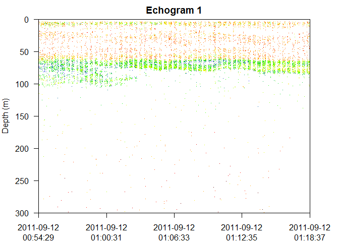

oXim
====

**Oxycline Index from Matrix Echograms**

This package is built to take echogram data from Echopen software outputs and calculate oxycline depth limits using image-filtering algoriths.

Installation
------------

Get the development version from github:

``` r
# install.packages("devtools")
devtools::install_github("LuisLauM/oXim")
```

Examples
--------

Read data from Echopen outputs
------------------------------

For reading data, it is necesary to specify Echopen outputs files (.m extension). ´readEchograms´ function returns an object of class ´echoData´, so some methods may be applied: print, summary and plot.

``` r

# Set directories where the Echopen's outputs are located
fileMode <- list(fish38_file   = system.file("extdata", "fish38.mat", package = "oXim"),
                 fluid120_file = system.file("extdata", "fluid120.mat", package = "oXim"),
                 blue38_file   = system.file("extdata", "blue38.mat", package = "oXim"))


# Read echograms (echoData object)
echoData <- readEchograms(fileMode = fileMode)

# Print method
print(echoData)
#> 
#> Number of echograms:  1 
#> 
#> For echogram 1:
#>  Range lon:  From 74.167° W to 74.113° W 
#>  Range lat:  From 17.218° S to 17.187° S 
#>  Range time: From 2011-09-12 00:54:29 to 2011-09-12 01:18:37

# Summary method
summaryEchodata <- summary(echoData)

# Print summary
print(summaryEchodata)
#> 
#> Number of echograms:  1 
#> 
#> For echogram 1:
#>      sA  lon lat time    
#>  Min.    -122.8  -74.17  -17.22  2011-09-12 00:54:29 
#>  1st Qu. -91.49  -74.15  -17.21  2011-09-12 00:59:50 
#>  Median  -85.38  -74.14  -17.2   2011-09-12 01:06:06 
#>  Mean    -84.41  -74.14  -17.2   2011-09-12 01:06:09 
#>  3rd Qu. -76.53  -74.13  -17.19  2011-09-12 01:12:21 
#>  Max.    -53.07  -74.11  -17.19  2011-09-12 01:18:37 

# Plot method
plot(echoData)
```



Calculate oxycline depth limits
-------------------------------

For oxycline depth calculation, ´getOxyrange´ function
